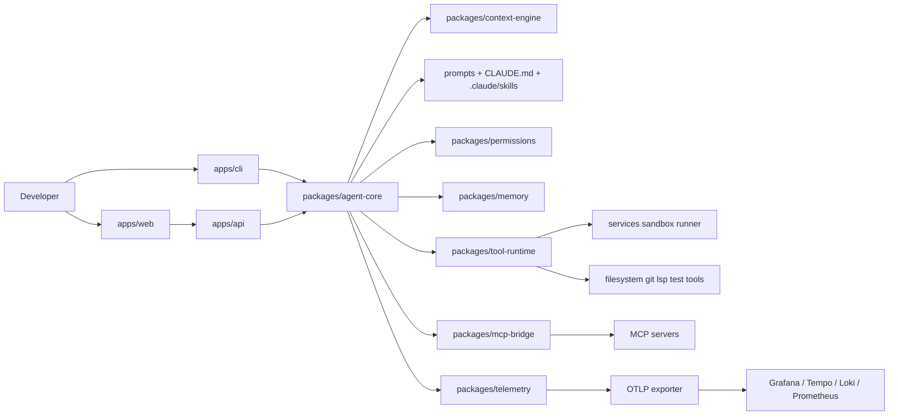

# **Project Overview**
**Autonomous Codebase Engineer is a local-first agentic developer that can inspect a repository, build a plan, edit files, run commands, evaluate results, and optionally call external MCP tools under explicit policy. The design is intentionally transparent: prompts, tools, permissions, memory, and telemetry are ordinary source files and ordinary packages.**

---

## Architecture Diagram


--- 

## Prerequisites
- Node.js 22+
- pnpm 10+
- Git
- Docker and Docker Compose
- Recommended local binaries: `rg`, `fd`, `git`, `python3`
- Optional for production-like testing: `kubectl`, `helm`

---

## Install and Bootstrap
```bash
corepack enable
corepack prepare pnpm@10.18.0 --activate

git clone <your-repo>
cd autonomous-codebase-engine

cp .env.example .env
pnpm install
pnpm build
docker compose --profile observability up -d
pnpm db:migrate
```

---

## Local Development Workflow
```bash
# full monorepo dev mode
pnpm dev

# run only the CLI
pnpm cli -- help

# run only the API
pnpm api

# run only the web app
pnpm web

# run the test stack
pnpm test
pnpm e2e
```

---

## Exact Example Commands
```bash
# read-only planning pass
pnpm cli -- plan "Analyze auth flows and propose an OAuth 2.1 migration plan"

# implementation pass
pnpm cli -- run "Implement the approved OAuth 2.1 migration in small commits"

# inspect a previous session
pnpm cli -- resume sess_01JX7R2P9Q3B6M2Z

# add an MCP server
pnpm cli -- mcp add github --command "npx -y @modelcontextprotocol/server-github"

# run evaluation fixtures
pnpm eval -- tests/evals/benchmark.yaml
```

